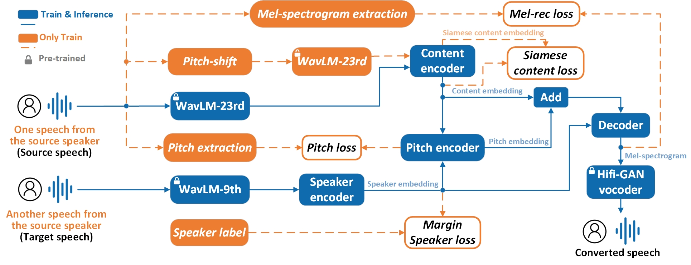

# 
 Voice Conversion based on Self-Supervised Features and Multi-Constraint Disentanglement Strategy

# ABSTRACT

 Enhancing model generalization and achieving sufficient disentanglement among different speech representations are the current focus of voice conversion (VC) research. To address these challenges, the proposed model adopts self-supervised features and designs a multi-constraint disentanglement strategy.  First, self-supervised features extracted by specific layers of the pre-trained speech processing model, WavLM, are employed as input for the speaker encoder and the content encoder to improve the model's generalization and simplify their architectures. Second, a multi-constraint disentanglement strategy is proposed to remove redundant information in pre-trained features. Specifically, the Siamese content loss is adopted to mitigate the speaker information leakage issue in content encoding, and the margin speaker loss based on AM-Softmax is introduced to alleviate the problem of overlap and fuzzy boundaries among different speakers. The pitch loss and the mel-spectrogram reconstruction loss are adopted to ensure the quality of the converted speech. Furthermore, the generalization strategy employed during the training stage makes the generated speech more realistic. Experimental results on the VCTK corpus demonstrate that the proposed model achieves excellent performance in objective and subjective evaluations under both seen and unseen scenarios.

The following is the overall model architecture.

  
  
Fig.1: The overall architecture of the proposed model.

# DEMO
For the converted samples, you can visit [the demo page](https://superman-valencia.github.io/SSL-VC-Demo/).
